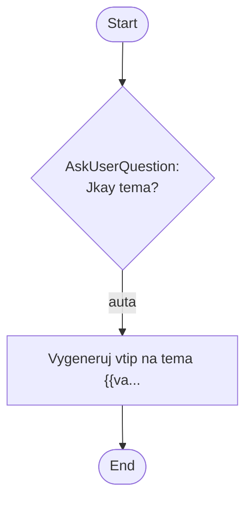

## Workflow Execution Guide

Follow the Mermaid flowchart above to execute the workflow. Each node type has specific execution methods as described below.

### Execution Methods by Node Type

- **Rectangle nodes (Sub-Agent: ...)**: Execute Sub-Agents
- **Diamond nodes (AskUserQuestion:...)**: Use the AskUserQuestion tool to prompt the user and branch based on their response
- **Diamond nodes (Branch/Switch:...)**: Automatically branch based on the results of previous processing (see details section)
- **Rectangle nodes (Prompt nodes)**: Execute the prompts described in the details section below

### Prompt Node Details

#### prompt_1772793246749(Vygeneruj vtip na tema {{va...)

```
Vygeneruj vtip na tema {{variableName}}.
```

### AskUserQuestion Node Details

Ask the user and proceed based on their choice.

#### question_1772793192951(Jkay tema?)

**Selection mode:** Single Select (branches based on the selected option)

**Options:**
- **lidi**: First option
- **auta**: Second option
